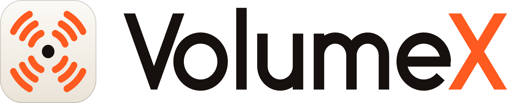
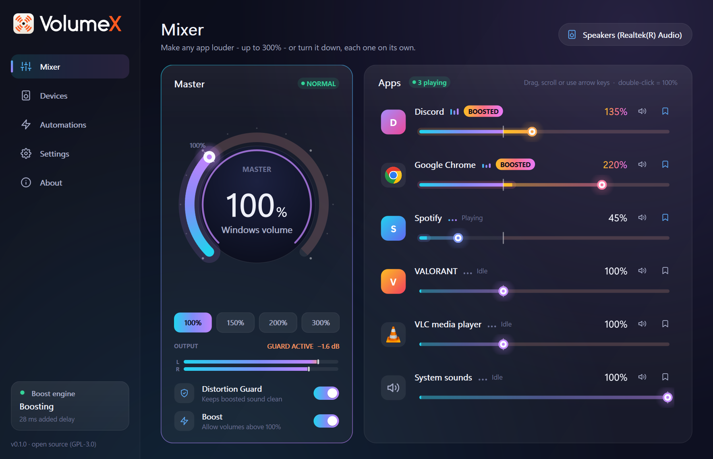
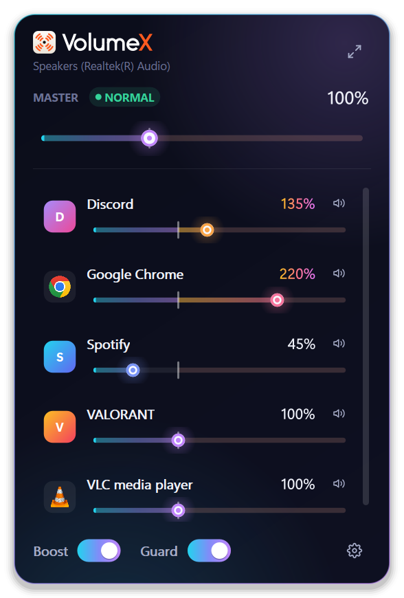
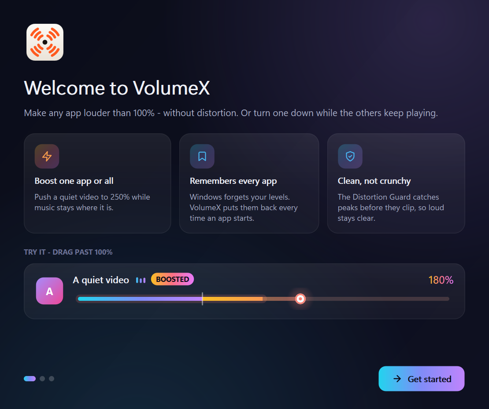

<p align="center">
  <picture>
    <source media="(prefers-color-scheme: dark)" srcset="assets/VolumeX-logo-reversed.png">
    
  </picture>
</p>

<p align="center"><b>Make any app louder than 100% - or turn it down - each one on its own.</b><br>
A free, open-source volume booster for Windows 10 and 11 · made by <a href="https://sihabsahariar.com/">Sihab Sahariar</a></p>

<p align="center"><a href="https://sihabsahariar.com/VolumeX/"><b>Website</b></a> · <a href="https://sihabsahariar.com/VolumeX/manual.html"><b>User manual</b></a> · <a href="https://github.com/SihabSahariar/VolumeX/releases/latest/download/VolumeX-Setup.exe"><b>Download for Windows</b></a></p>



## Why VolumeX

| | Windows mixer | Typical boosters | **VolumeX** |
|---|---|---|---|
| Boost one app above 100% | ✗ | ✗ (system-wide only) | **✓ up to 300% (500% unlockable)** |
| Boost everything | ✗ | ✓ | **✓** |
| Remembers each app's level | often forgets | ✗ | **✓** |
| No distortion when boosting | – | often crackles | **✓ look-ahead limiter on by default** |
| Leaves unboosted apps alone | – | routes everything | **✓ zero added delay for them** |
| Hijacks your default device | – | usually | **✗ never** |
| Code injection (anti-cheat risk) | – | some | **✗ never** |
| Undo everything on quit, crash or uninstall | – | rarely | **✓** |

**Features**

- A big master dial plus a slider for every app, each with a live level meter and a clearly marked boost zone past 100%.
- One-click quick boosts: 100%, 150%, 200% or 300%.
- **Distortion Guard**, a look-ahead limiter, keeps boosted audio from clipping.
- A tray flyout for quick changes.
- Global hotkeys, including **Ctrl+Alt+↑ to boost the app you're using right now**.
- A master boost remembered per output device, so your Bluetooth headphones get their own level.
- Rules such as "when Zoom starts, set Spotify to 30%".
- Six accent themes, a first-run wizard and a hearing-safety notice.
- One-click setup: VB-CABLE, the virtual audio device boosting relies on, ships with VolumeX and installs with a single click. There's nothing to download or unzip yourself.

<p>


</p>

## How it works

Windows won't set any volume above 100%. To boost, the audio itself has to be amplified:

```
 apps at ≤100% ──────────────────────────────────────────────► speakers (untouched, 0 ms added)
 apps above 100% ──► VB-CABLE (silent) ──► VolumeX engine: gain ─► Distortion Guard ─► speakers
```

- Only boosted apps are sent through **VB-CABLE**, a free virtual audio device by VB-Audio that ships with VolumeX. The engine captures it, raises the level, limits peaks and plays the result on your real device.
- One engine gain serves every app. Each app's own level comes from its Windows volume: the engine uses the highest boost, and quieter apps are scaled down within Windows (the "ratio trick").
- Every change is written to a journal first, so VolumeX can always put Windows back the way it was.

The full design is in [design/PRODUCT_AND_ARCHITECTURE.md](design/PRODUCT_AND_ARCHITECTURE.md). For how to use every screen, see the [user manual](https://sihabsahariar.com/VolumeX/manual.html) (also available as a [PDF](docs/VolumeX-User-Manual.pdf)).

## Install

1. [Download](https://github.com/SihabSahariar/VolumeX/releases/latest/download/VolumeX-Setup.exe) and run `VolumeX-Setup.exe`. VolumeX itself installs per user, without admin rights.
2. Keep **"Install VB-CABLE by VB-Audio"** ticked. Windows asks for permission once, then setup offers to restart your PC to switch VB-CABLE on.

If you skip VB-CABLE, VolumeX still works as a smart mixer up to 100% that remembers every app's level. You can install VB-CABLE later from the Mixer: click **Unlock boost**, then **Install VB-CABLE**.

### About VB-CABLE

[VB-CABLE](https://vb-audio.com/Cable/) is made by **VB-Audio** and is donationware.

- **What VolumeX ships:** VB-Audio's official, unmodified package, which [VB-Audio's licence](https://vb-audio.com/Services/licensing.htm) allows for donationware use.
- **Signature check:** VolumeX checks VB-Audio's code signature before running its setup.
- **Please support VB-Audio:** if VB-CABLE is useful to you, [support VB-Audio](https://shop.vb-audio.com/en/win-apps/11-vb-cable.html). Links are also on VolumeX's Devices and About pages.

## Run from source

```powershell
python -m venv .venv
.venv\Scripts\pip install -e .[dev]
.venv\Scripts\python -m volumex            # the real thing
.venv\Scripts\python -m volumex --demo     # simulated apps and devices; your audio is never touched
.venv\Scripts\python -m volumex --dry-run  # reads your real audio but never changes it
```

Other flags:

- `--minimized`: start in the tray.
- `--restore`: undo VolumeX's routing changes and exit.
- `--verbose`: more detailed logs.

Logs are written to `%LOCALAPPDATA%\VolumeX\logs`.

## Build and test

```powershell
.venv\Scripts\python packaging\fetch_vbcable.py           # VB-Audio's package into third_party/ (checksum + signature checked)
.venv\Scripts\python -m pytest                            # 136 tests: reconciler math, controller, engine DSP, platform
.venv\Scripts\python scripts\screenshot.py              # capture every screen into docs/assets/img (demo data)
powershell -ExecutionPolicy Bypass -File packaging\build.ps1
```

The app icon, logo and tray icons come from the VolumeX brand kit (`assets/VolumeX logo kit.zip`, installed in `volumex/resources/brand`). `build.ps1` fetches VB-CABLE and produces `dist\VolumeX\`, containing `VolumeX.exe`, `VolumeXEngine.exe` and `vbcable\`, plus the portable `dist\installer\VolumeX-win64.zip`. If [Inno Setup 6](https://jrsoftware.org/isinfo.php) is installed, it also produces `dist\installer\VolumeX-Setup.exe`.

## Website and manual

The product website is plain HTML in `docs/`, published with GitHub Pages like Umbra's.

1. Push this repository to `github.com/SihabSahariar/VolumeX`.
2. Go to **Settings → Pages**, choose **Deploy from a branch**, then **main** and **/docs**.

The site then appears at `sihabsahariar.github.io/VolumeX`, which redirects to `sihabsahariar.com/VolumeX/`. It has two pages:

- **`index.html`:** the landing page, with an in-browser boost demo built on Web Audio.
- **`manual.html`:** the user manual.

After changing the UI:

1. Run `scripts/screenshot.py` to refresh the screenshots.
2. Print `manual.html?pdf` to `docs/VolumeX-User-Manual.pdf`. Its print styles produce the A4 layout. Headless Edge works:
   ```powershell
   msedge --headless --no-pdf-header-footer --print-to-pdf=docs\VolumeX-User-Manual.pdf "file:///<repo>/docs/manual.html?pdf"
   ```

Releases must include `VolumeX-Setup.exe` and `VolumeX-win64.zip`, both produced by `build.ps1`. The site links to `releases/latest/download/<name>`.

## Project layout

```
volumex/
  core/          controller (the brain), reconciler (pure routing/volume math), models
  platform/      Windows Core Audio (pycaw), per-app routing, hotkeys, autostart, fake system for demo/tests
  engine/        audio engine process: capture → gain → limiter → render (JSON-lines protocol on stdio)
  engine_client/ starts and supervises the engine
  safety/        write-ahead journal + restore
  storage/       settings (%APPDATA%\VolumeX\settings.json)
  ui/            PyQt5 interface: theme, widgets, pages, tray flyout, OSD, setup wizard
packaging/       PyInstaller spec, Inno Setup script, build script, VB-CABLE fetcher
docs/            the website (GitHub Pages): landing page, manual, screenshots, PDF manual
design/          product & architecture plan
tests/           pytest (+ pytest-qt, hypothesis)
```

## Known limitations

- **Delay:** boosted apps get about 20-45 ms of extra delay. That's fine for video and music, but you may notice it in competitive games. Unboosted apps get none.
- **Apps that need a restart:** some apps, such as Spotify, only switch to the boost path after a restart. VolumeX tells you when this happens.
- **Apps VolumeX can't boost:** apps using exclusive-mode audio, and apps set to a fixed output device in their own settings, bypass the Windows mixer.
- **Browser tabs:** Windows treats a browser as one app, so you can't boost individual tabs.
- **Engine language:** the audio engine is currently Python. A native (C++) engine and VolumeX's own signed driver are on the roadmap. The engine already speaks a language-neutral protocol, so it can be swapped without changing the app.

## Uninstalling

The uninstaller runs `VolumeX.exe --restore --clear-closed-apps` before removing any files.

- **Running apps:** every app VolumeX routed is sent back to your normal device.
- **Closed apps:** if an app VolumeX routed is closed at that moment, Windows only lets VolumeX reset it by clearing *all* per-app device choices. Any per-app devices you set yourself in Windows Settings are cleared too.
- **VB-CABLE:** if VolumeX installed it, the uninstaller asks whether to remove it too. The default answer is No, because other apps may use it.

## Author

**Sihab Sahariar** · [Website](https://sihabsahariar.com/) · [GitHub](https://github.com/SihabSahariar) · [LinkedIn](https://www.linkedin.com/in/sihabsahariar/) · [X](https://twitter.com/SihabSizan) · [YouTube](https://www.youtube.com/@sihabsahariar) · [Medium](https://sihabsahariar.medium.com/)

**Also try [Umbra](https://sihabsahariar.com/Umbra/)**: look away, and your screen hides itself. It's a free, open-source privacy screen for Windows. [Download](https://github.com/SihabSahariar/Umbra/releases/latest/download/Umbra-Setup.exe)

## License

GPL-3.0-or-later. See [LICENSE](LICENSE). Icons are from [Feather](https://feathericons.com) (MIT). VB-CABLE © V. Burel / VB-Audio, distributed under VB-Audio's licence.
